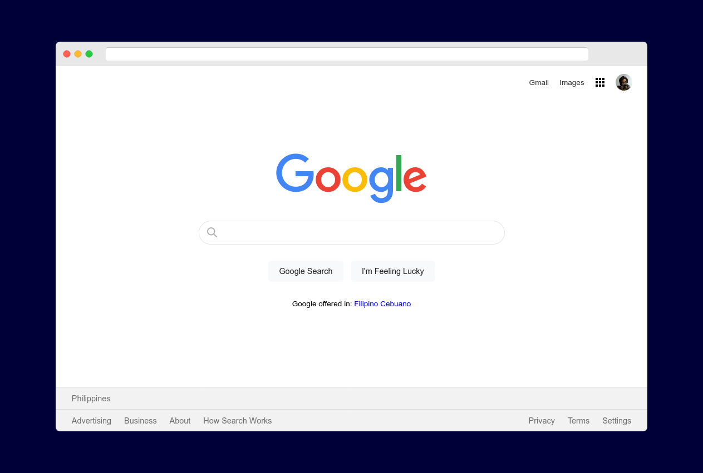

# Project: Google Homepage

A mini-project where I build the Google homepage from scratch to practice HTML and CSS basics.

This is part of the [Foundations](https://theodinproject.com/courses/foundations) course in [The Odin Project](https://theodinproject.com/) curriculum.

## Notes about the project

I built a [simple copy of the Google homepage](https://joshjavier.github.io/google-homepage/)!

No interactivity or media queries, just plain HTML and CSS with some hover effects.

Many of the concepts were familiar to me (I previously went through freeCodeCamp's [Responsive Web Design certification](https://www.freecodecamp.org/certification/joshjavier/responsive-web-design)) but I haven't practiced them for a while, so I had difficulty figuring out how to structure the code to make the HTML and CSS work together.

Some observations:
- I tend to spend time trying to follow best practices, like using `row` and `container` utility classes. I realized that for small projects like this, it's faster to **make it work first**, then if you have time later, go back and refactor as you like.

- This is the first project where I actively used git for incremental commits. The game analogy of "saving my progress in a checkpoint" definitely helped reinforce this habit. Another positive effect is that it helped me divide my work into smaller, more focused chunks -- around what would fit in a git commit message. This made working on the project feel less overwhelming, and led to me taking breaks instead of hopelessly hammering at a roadblock when my brain is already tired.

- I think some parts could have been better implemented with CSS Grid, but I need more practice...

## Acknowledgments

- Search icon from [Icons8](https://icons8.com/)
- [Modern CSS Reset](https://github.com/hankchizljaw/modern-css-reset)
- The stuff I learned from [Conquering Responsive Layouts](https://courses.kevinpowell.co/courses/conquering-responsive-layouts) has helped me with best practices and how to think about solving problems
- [MDN Web Docs](https://developer.mozilla.org/en-US/), especially their articles on [Advanced form styling](https://developer.mozilla.org/en-US/docs/Learn/Forms/Advanced_form_styling), [Organizing CSS](https://developer.mozilla.org/en-US/docs/Learn/CSS/Building_blocks/Organizing), and the [`<input>` element](https://developer.mozilla.org/en-US/docs/Web/HTML/Element/input)

## License

Licensed under "THE BEER-WARE LICENSE" (Revision 42):
Josh Javier wrote this code. As long as you retain this notice you can do whatever you want with this stuff. If we meet some day, and you think this stuff is worth it, you can buy me a beer or coffee in return.
